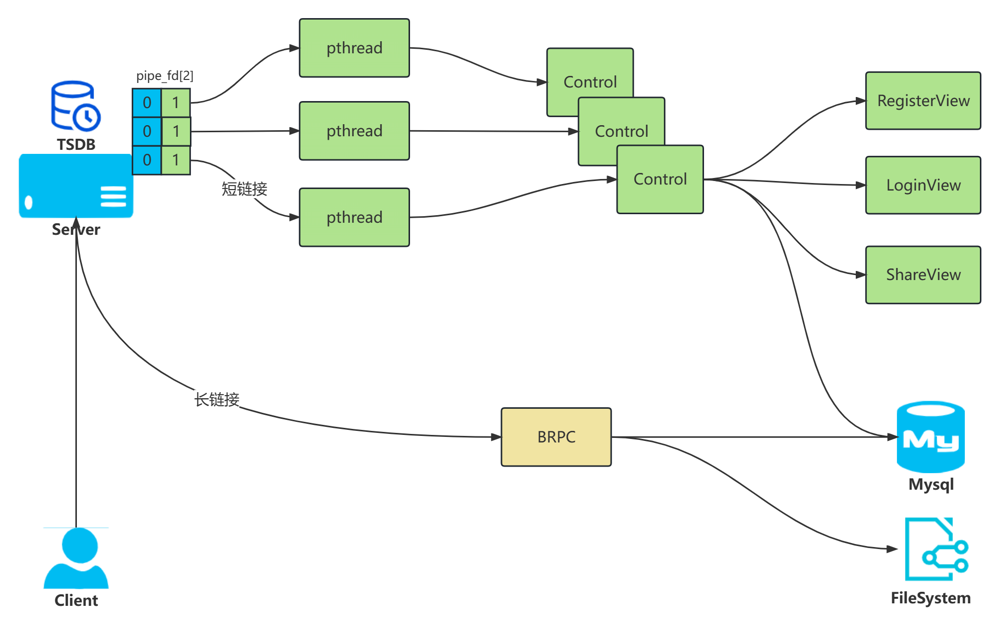

# Network disk server介绍
基于C++ oop思想、TCP/IP协议，实现了大规模网盘服务器，支持了用户注册、验证登录、文件查看上传下载。
针对文件的上传下载做了以下优化：
- 下载提速
- 多点下载
- 断点续传
- 文件秒传

同时升级了系统的kpi监控，支持更加准确的kpi计算，详见设计文档中RequestCounter设计。

## 目录结构
```
|-- code 项目源代码
|  `|-- cmd 客户端和服务器启动入口 
|   |-- include
|      `|-- long_connect  短链接相关头文件
|       |-- short_connect 长链接相关头文件
|       |-- ... 其他公共头文件
|  |-- src
|     `|-- long_connect   长链接操作源代码
|      |-- short_connect  短链接操作源代码
|      |-- ...   其他
|  |-- proto     长链接brpc protobbuf格式
|-- demo  服务器中一些组件自测的demo
|-- docs
|  `|-- 环境搭建 编译部署需要的组件环境
|   |-- 设计文档 
|-- make.sh 使用CMake编译的脚本
```

## 项目架构
项目架构设计详见：[大规模网盘系统设计文档](./docs/设计文档/大规模网盘系统设计文档.md)


## Getting started
- 编译环境：编译是需要联编部分动态库，参见[环境搭建](./docs/环境搭建)中的组件

- 部署环境：待补充（docker promethues minikube）
1. mysql 端口默认3306
2. 如果需要查看监控，需要安装prometheus、node_exporter、grafana，配置为prometheus.yml

- 编译运行：
1. 执行下面的命令进行编译,服务器的bin为build/serverMain，客户端的bin为build/clientMain
```
git clone https://github.com/ZhangTietie/network-disk-server.git
sh make.sh
```
2. 服务器的bin为build/serverMain，代码中提供了默认配置可以通过gflags的方式进行修改，内容参考include/gflag_def.h
3. 客户端的bin为build/clientMain 通过命令行进行注册、登录、上传等操作

