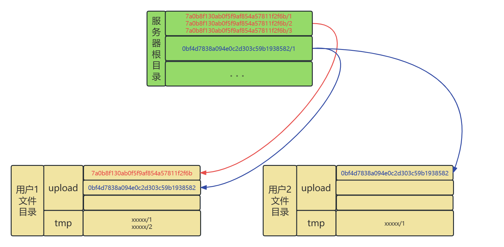
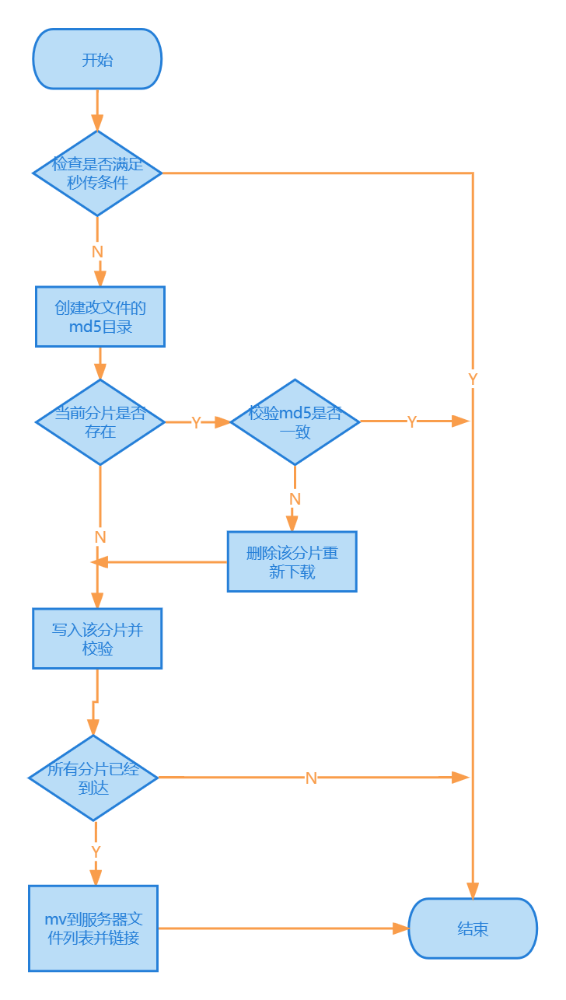

# 1. 背景
伴随着互联网的发展，手机端和PC对于文件存储的需求激增，网盘业务深入解决用户对文件存储的痛点，同时多文件、大文件等场景也对该业务提出巨大的挑战。  
在大规模分布式系统中，除了要考虑到系统流程设计更要思考如何更大限度地支持并发以及服务器的扩展。

# 2. 设计目标
## 2.1 功能目标
- 支持用户状态，包括：注册、登录、退出
- 支持文件操作：上传、下载、删除、分享
- 支持下载提速、断点续传、多点下载功能
- 支持相同文件秒传
- 支持授权查看
## 2.2 架构目标
- 多client连接最大化并发
- 服务器连接、数据落盘的可重入问题
- 系统实时监控

~~多容器部署~~  
~~高可用部署~~

# 3. 设计折衷
## 3.1 文件存储
### 3.1.1 储存位置
每一个网盘server接收到的用户文件都应该进行持久化存储，在多地域的分布式系统中最常用方案是使用hdfs进行文件存储。  
但是，mini hadoop搭建最少需要1台master+2台slave，参考腾讯云最小规格服务器40rmb/月，成本过于高昂  
所以最终决定使用Linux文件系统模拟hdfs文件系统，其mkdir、ls、delete语义也基本一致，在单个物理机上启动多个server或docker容器进行文件挂载也可以模拟这一场景。
ps：物理机部署优先使用软链，hdfs如果不支持软链可切换为硬链
### 3.1.2 持久化
关于文件落盘需要考虑以下两个问题
1. 优化存储空间：对于相同的文件服务器端应该只保存一份。综下所述使用方案二更加合理。
    - 方案一：建立一张检索表，在每次客户上传文件时检索文件位置。  
    优点：逻辑实现简单，只需要根据文件签名进行检索后返回结果。
    缺点：当存在大量文件时，检索时间线性递增不好优化。
    - 方案二：使用文件签名进行存储和检索
    优点：当文件数量过多时，可以根据签名的前n项进行一次或多次分桶，检索性能不会出现瓶颈。
    缺点：实现相对方案一复杂一些。
2. 文件落盘可重入性：在多个client连接时，可能会出现同时写入一个文件的情况。  
使用互斥锁可能会影响上传性能，可以先将文件写在tmp目录下，等待全部完成后进行ln原子操作，如果返回的失败时fileExist说明文件已经被上传成功。
### 3.1.3 网络传输
选择网路传输有两个方案：  
方案一：直接使用socket+TCP协议进行传输：
- 优点：
    1. Linux原生的网路传输协议，可以支持几乎所有的网络配置的修改十分灵活
    2. 直接使用TCP协议进行传输，可以最小代价地保证传输地可靠性。
    3. 可以针对网盘的各种大文件定制文件压缩方式，降低带宽的使用，提高传输速度。
- 缺点：
    1. 每条链接都需要创建socket，读取数据流后解析，业务逻辑和网络协议嵌套，代码复杂度提升
    2. 上传文件的时间较长，需要保持长连接。大量的长连接会对服务器造成巨大压力，所以必须要先完善链接的管理方式、心跳包等逻辑，工作量较大。

方案二：使用成熟的RPC框架托管网络传输（brpc）：
- 优点：
    1. 屏蔽了底层协议、长链接管理等问题，使用起来更加简单。后期升级server业务代码改动方便。
    2. 使用protobuf进行序列化，对字符串会自动进行压缩，可以满足当前业务场景。
    3. 提供了cpu heap profiles和其他一些易用的组件
    4. 可以直接使用bvar mbvar 进行服务监控
- 缺点：
    1. 相比直接使用socket，性能会有损失，并且在极致的性能调优时会出现瓶颈

综上：考虑到在带宽普遍小于1G的机器上，秒级别的上传时间可以忽略毫秒级别socket带来的优化。  
鉴于排期和代码实现复杂度，用少量的性能损失换取代码良好的抽象封装和代码可读性是十分划算的，所以对两个方案进行融合  
对于用户注册登录等低频并且能立刻返回结果的操作使用socket进行处理，上传、下载文件使用RPC托管长连接。

# 4. 架构设计图


# 5. 第三方库
## 5.1 libevent
libevent是一个事件通知库；封装了reactor。  
libevent API 提供了一种机制，用于在文件描述符上发生特定事件或达到超时后执行回调函数。  
```
//初始化libevent
struct event_base* event_base = event_base_new();
//新建一个监听事件
struct event* listen_event = event_new(event_base, fd, EV_READ|EV_PERSIST, recvClientMsg, NULL);
//将监听事件加入到监听列表
event_add(listen_event,NULL);
//开始循环监听等待事件触发
event_base_dispatch(event_base);
```

## 5.2 MD5
对字符串进行签名的散列函数，没有响应的库文件，所以使用popen
```
string cmd = "md5sum " + file_name;
FILE *fp = popen(cmd.c_str(), "r");
char buf[33];
int nread = fread(buf, 1, 32, fp);
buf[32] = '\0';
```

## 5.2 brpc
开源的rpc框架，屏蔽了底层客户端和服务器的链接管理，可以使用类函数调用的方式进行网络交互，包含：
- 基础信息传递功能
- gflag控制链接状态和策略
- bvar提供监控项支持

# 6. 功能设计
## 6.1 下载提速
- 使用brpc上传时会将string和bytes类型的数据进行序列化，该步骤会将文件压缩。
- 如果后续需要进一步压缩，brpc框架中包含gzip选项可以进行尝试。

## 6.2 多点下载、断点续传
- 客户端在上传时会将文件分为多份并行上传，故下载时也会并行下载，达到多点下载的效果哦
- 当客户端上传文件只有部分到达时，已完成的部分会保存在用户目录下，下次上传文件校验md5一致后会跳过已上传成功的部分做到断点续传。

## 6.3 相同文件秒传
- 所有文件在服务器中都以md5值为目录进行存储，相同文件在上传时检索到服务器已有该文件，直接使用link将其链接到用户目录下，不需要再次上传。

## 6.5 授权查看
- 系统包含用户管理系统，当文件授权查看时，将该文件的md5加入到用户对应的已授权列表中即可查看。


# 6. 详细设计
## 6.1 ServerMain
系统主函数的入口：
1. 初始化glog
1. 构造启动接收短链接的ShortConnectionServer
    1. 创建接收客户端请求的main_socket，并将该文件描述符的读事件加入libevent
    2. 对于每个处理请求的支线程，创建一个无名管道用于将接收客户端请求的fd传递给支线程，0端写 1端读。
1. 构造启动接收长连接的LongConnectionServer
    1. 实现upload、download RPC 函数。

## 6.2 Mpthread
1. libevnt 并非线程安全，所以每个Mpthread中都要创建一个 event_base.
1. 每个Mpthread中构造一个Control类，作为处理不同类型消息的proxy。
1. 使用pthread创建支线程，监听管道的1端，如果1端有读事件发生则说明有新的客户端发来消息，recv。并将其发送给Control类处理。 

## 6.3 MVC
整个系统采用了类MVC的设计模式，做到程序前台交互与后台计算的解耦：
1. Model: 接收客户数据的类，封装用户的输入
1. View： 封装多种视图操作，视图之间相互独立，共同继承View基类。
1. Contol：控制层作为调度器将Model接收的不同消息类型发送给指定视图

## 6.4 mysql结构
### 6.4.1 Usr 表
负责保存用户账户信息，每个用户都有独立的uid

| 字段 | 含义 | 类型 | 备注 |
| -----| ---- | ---- | ---- |
| uid       | 用户的唯一id | int(8)  | auto_increment，primary key |
| name      | 用户名       | varchar(10) | 无 |
| passwd    | 密码         | varchar(10) | 无 |

### 6.4.2 SignMap表
保存了从文件名到文件名的映射

| 字段 | 含义 | 类型 | 备注 |
| -----| ---- | ---- | ---- |
| sign | 文件md5 | varchar(64) | primary key |
| fileName | 文件名 | varchar(20) | 无|
| reference | 文件引用计数| int32 | 无|

```
create table Usr (
uid int(8) auto_increment,
name varchar(10) not null unique,
passwd varchar(10) not null,
primary key(uid)
);

create table File (
uid int(8) not null,
path varchar(32) not null unique,
share text,
primary key(uid),
constraint fk_Usr_File foreign key(uid) references Usr(uid)
);

create table SignMap (
sign varchar(64) not null,
fileName varchar(20) not null,
reference int not null,
primary key(sign)
);
```

## 6.5 FileSystem存储目录结构


## 6.5 view 流程
### 6.5.1 注册--RegisterView
1. 检查用户名是否存在
1. 创建Usr表中的一行，填充name passwd
1. 创建用户目录
1. 返回repsonse，客户端响应注册结果

### 6.5.2 登录--LoginView
1. 检查客户端为登录状态
1. 查找Usr表，检查用户名、密码
1. 查找File表，返回所有用户文件、被分享文件、未下载完成文件
1. 客户端输出返回结果，并设置登录标志位

### 6.5.3 注销--LogoutView
1. 客户端检查当前登录标志位
1. 服务器成功响应后修改标志位

### 6.5.4 上传--Upload
- 客户端
1. 检查客户端登录状态
1. 根据配置将文件分为n份
1. 每份发送一个rpc请求并等待请求返回

- 服务器端
1. 通过md5检查服务器中是否已经存在该文件，如果存在直接link后返回成功，引用计数加1
1. 创建该文件md5的目录
1. 查看当前分片是否存在，如果已存在且校验md5一致返回成功
1. 将该分片写入，并计算md5校验
1. 检查所有分片是否已经到达，如果未全部到达则该分片返回成功
1. 将文件mv到服务器文件列表后link到用户目录，引用计数+1，返回成功

  


### 6.5.5 下载--Download
1. 对比本地文件和本地已有文件分片，得到待下载文件列表
1. 依次请求代下载文件列表，校验所有分片下载完成后拼接
1. 校验拼接后文件的md5
1. 没问题的话将内存中的文件dump到本地

##6.6 Clinet详细设计

## 6.7 CS交互格式
短链接发json
```
//request
{
    "Type:" : 1,
    "Name" : "lxw01",
    "Passwd" : "123",
    "Msg": "xxxx"
}
//response
{
    "Response" : "xxxx",
    "Shared": "xxxx",
    "Files": "xxxx",
    "NotDown": "xxxx",
}
```
长链接发rpc
proto 格式

```
syntax="proto2";
package example;

option cc_generic_services = true;

message NetDiskRequest {
    required uint32 op_type = 1;
    //文件总分片数
    required uint32 shard = 2;
    //当前文件所在分片
    required uint32 part_index = 3;
    //当前文件所在分片的md5
    required uint32 part_sign = 4;
    //文件名
    required bytes file_name = 5;
    //文件所有分片合并后md5
    required string file_sign = 6;
    //文件提交的用户名
    required string usr = 7;
    //文件内容
    required bytes body = 8;
};

message NetDiskResponse {
    //返回服务器msg、标记错误
    required bool res = 1;
    //文件分片数
    required uint32 shard = 2;
    //当前文件所在分片
    required uint32 part_index = 3;
    //文件名
    required string file_name = 4;
    //文件内容
    required string message = 6;
};

service NetDiskService {
      rpc Send(NetDiskRequest) returns (NetDiskResponse);
};

```

# 7. 高可用部署

## 7.1 使用minikube部署服务

## 7.2 监控


### 6.9.2 Client 流程

## 7. Prometheus metric

## 8. RequestCounter 设计

### RequestCounter背景
在当前分布式服务常见的监控系统中，对于请求成功率通常使用 （请求数-失败数）/ 请求数 进行计算，但是对于请求数和失败数进行取值操作时并不是原子性的
所以在查看系统监控时经常会出现某一时间点出现成功率大于1或者小于0的情况，数据结果不置信，业界的rpc框架或流式监控系统并没有解决该问题

### RequestCounter 设计折中
方案一：定义一个新的

dbd


```

```
